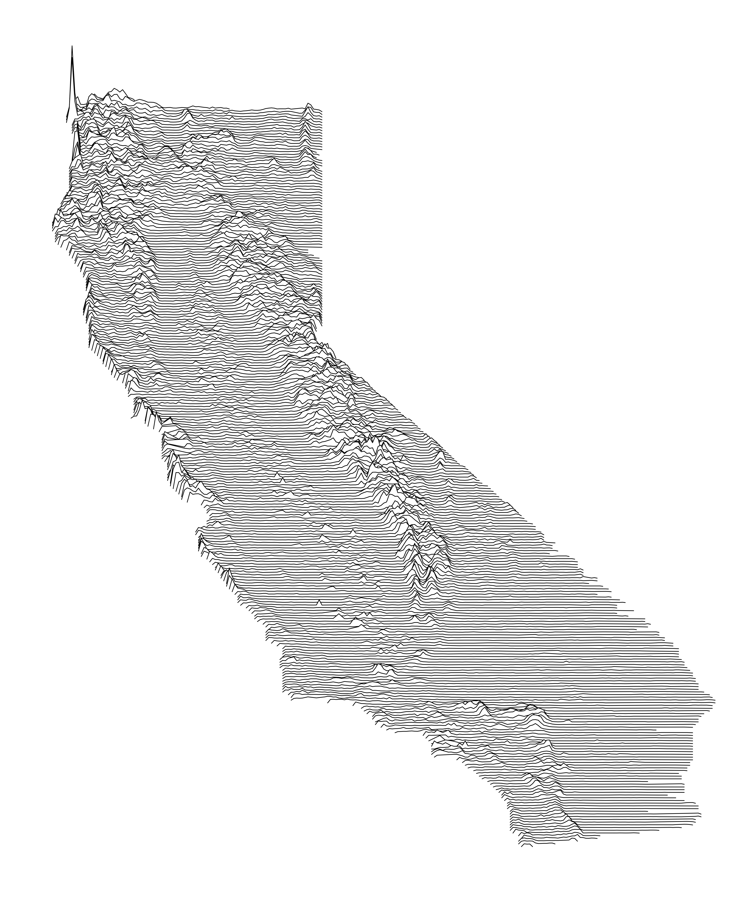

# Create Minimalist Line Maps

*Above Map Shows Biomass of CA*

***
All work is done with R statistical software

Requirements:
+ Raster data of something
+ Shapefile of area of interest
+ R software

***

Libraries needed

    library(dplyr) # data manipulation
    library(raster) # read raster data
    library(sf) # read polygons
    library(ggplot2) # graphing 
    library(data.table) # for raster manipulation

Inspired by a few blogs posts I found while researching the velox package. 

[velox](http://philipphunziker.com/velox/extract.html)

[Helpful blog](https://www.whackdata.com/2014/08/04/line-graphs-parallel-processing-r/)

Script should be generalizable to any data inputs.

Have fun.
