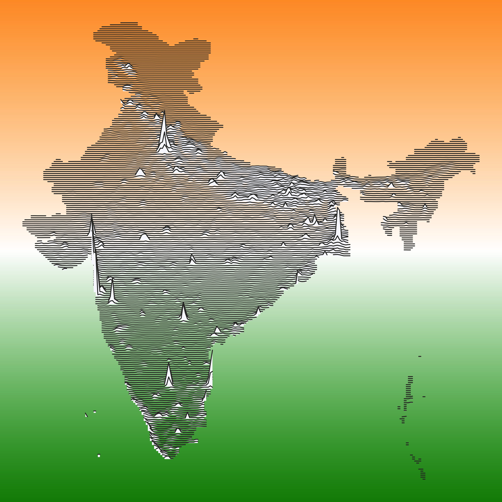

# Create Minimalist Line Maps
+ [Purpose](#Purpose)
+ [Requirements](#Requirements)
+ [Libraries](#Libraries-needed)
+ [Resources](#Resource)

*Population Density of India* 

*Above Map Shows Biomass of CA*

## Purpose

To make sylistic maps from any raster data input in reproducable and understandable code

***
All work is done with R statistical software

### Requirements
+ Basic familiartity with spatial data and data structures
+ Raster data of something
+ Shapefile of area of interest
+ R software

***

### Libraries needed

    library(dplyr) # data manipulation
    library(raster) # read raster data
    library(ggplot2) # graphing 
    library(sf) # read polygons
    library(ggridges) # achieves ridges look to data
    library(grid) # extra background plotting function
    library(RColorBrewer) # not needed but nice to play with 

This script can be used to make a map similar to the one above with any input raster. 
Added functionality to make a gradient raster in the background.

### Resources

Population density used to make the India map can be found [here:](https://sedac.ciesin.columbia.edu/data/set/gpw-v4-population-density-rev11)

A good resource for shapefiles is [Natural Earth](https://www.naturalearthdata.com/)
***

This workflow is inspired by a blogs postsI found while researching the excellent [velox package](http://philipphunziker.com/velox/extract.html). 

This lead me to another [useful blog](https://www.whackdata.com/2014/08/04/line-graphs-parallel-processing-r/) post about line maps.

The [ggridges](https://cran.r-project.org/web/packages/ggridges/vignettes/gallery.html) library was also very useful as it cleans up the workflow and plotting functionality considerably. 
